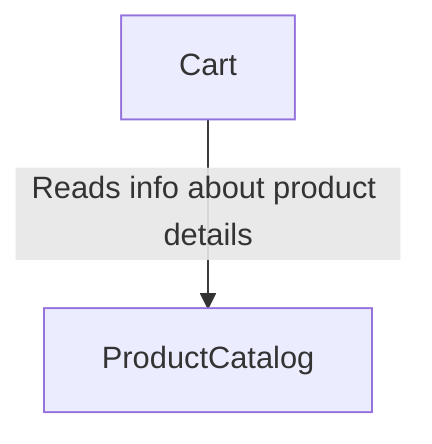

# Backend

The backend is written in Go and split into several smaller parts:

* [cart](https://github.com/nivesh852/ecommerce/tree/main/backend%20/cart%20)
* [product catalog](https://github.com/nivesh852/ecommerce/tree/main/backend%20/productcatalog%20)
* [internal](https://github.com/nivesh852/ecommerce/tree/main/backend%20/internal%20)
* [cmd/web](https://github.com/nivesh852/ecommerce/tree/main/backend%20/cmd/web%20)

## Context map

The [Context map](https://www.infoq.com/articles/ddd-contextmapping/) is a way we can visualize how different Bouded Contexts interracts with each other. I decided to use more technical variant of it to better visualize how those relations look like.



## Requirements

To be able to run the project you have to have Go installed. By default, it works with an postgres database implementation. For further configuration credentials and so on please go to the [web](https://github.com/nivesh852/ecommerce/tree/main/backend%20/cmd/web%20) page.

## Running tests

Tests can be run in two modes - with in-memory implementation and using a PostgreSQL database.
Tests by default run using in-memory version so the only thing you need to do to run all tests is executing the following command.

```sh
go test ./...
```

To run the same set of tests but against a running PostgreSQL database (aka integration/medium tests) you have to run the following command.

```sh
go test ./... -tags=integration
```

It uses Go build tags to choose the proper persistent storage implementation.

You can configure the PostgreSQL connection string by changing env variables:

 - `POSTGRES_HOST`
 - `POSTGRES_PORT`
 - `POSTGRES_USER`
 - `POSTGRES_DB`
